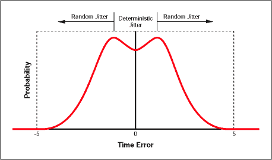

# Statistics

Concerning the collection, organisation, analysis, interpretation, and presentation of data. The opposite of mechanistic modelling. Used to learn, describe, and predict the behaviour of systems after empirical data has been collected. Statistical or correlation studies often bypass the need for causality and focus exclusively on prediction, and not mechanistic explanations of “why?”. As most data is computer generated (Ninety per cent of the world's data have been generated in the last 5 years), these methods are often closely intertwined with computer algorithms. Permutations and combinations, allow us to work with simple discrete known populations and directly calculate probability from it. Random variables. Intersections and unions of sets. Multiplication rule. Bayes’ theorem, the central limit theorem and the law of large numbers, co-variance and correlation, and maximum likelihood estimation (MLE). Probability density functions and cumulative design functions

# Jitter Modeling

'Understanding and Characterizing Timing Jitter' - Primer by Tektronix

* Jitter is short term variation w/ frequencies above 10 Hz, other it is called "wander"
* Must be characterized w/ statistics (mean, standard deviation $\sigma$, and confidence interval)
* High pass filter is useful for physical measurement, to cancel "wander"
* This can be a PLL, which is "nice" because it mimics a real system
* Ideal sinusoid is ideal reference, most often (with same freq. and $\phi$), found via min $\Sigma(error)^2$

$$
A*\sin(\omega_c*t+\phi_c)
$$

where $\omega_c$ and $\phi_c$ are constants chosen to minimize timer error of positions.

## Sampling

Samples in the measurement of jitter can be acquired in three way:

1. Periodic Jitter $J_p$ : Just a histogram of signal periods of a persistent period, measured often in persistence mode (trigger on one edge/peak of waveform, and then measure 'width' on the subsequent edge/peak)

3. Cycle-to-Cycle $J_{c2c}$: First order difference of period jitter, which show dynamics from cycle-to-cycle, for a PLL, etc

$$
J_{c2c}=J_{P_{n+1}}-J_{P_{n}}
$$

3. Time-Interval Error (TIE): uses deviation from ideal reference. Difficult to observe directly with oscilloscope in experimental setup, but is good as it reveals cumulative effect of jitter

$$
TIE_n = \sum\limits_{0}^{n}(J_{p_{n}}-t_{ideal_{n}})
$$

where $n$ is the cumulative edge number, in time. The more cycles go by, the further we will likely find ourselves from the ideal

## Jitter Statistics

Mean of the distribution is the reciprocal of the frequency of the signal.

Next, regardless of which method you use to measure timing error, the statistical PDF can either be characterised by it's standard deviation (RMS), or by a more stringent metric tied to a BER. For example, 68% percent of distribution is within one standard deviation, but a BER of 0.32 would be unacceptable, so

$$
J_{pp} = α * Jitter_{rms}
$$
The reason for this peak-to-peak concept is that Gaussian random processes technically have an unbounded peak-to-peak value - one theoretically just needs to take enough samples.

|BER|α|
|---|---|
|10-3|6.180|
|10-4|7.438|
|10-5|8.530|
|10-6|9.507|
|10-7|10.399|
|10-8|11.224|
|10-9|11.996|
|10-10|12.723|
|10-11|13.412|
|10-12|14.069|

## Random vs Determinisitc

The convolution of random data with a deterministic waveform jitter, will create a non-gaussian PDF. For example, in a system with different rise and fall times, the PDF will be Bimodal:

It's instead convolved with a sinusoidal waveform, then you will have a normal area in the middle, with sharp rising gaussian components on the edges.

# Signal Sampling Theorem

Whittaker-Shannon-Nyquist sampling theorem says there is no info loss when digitizing band-limited analog signals, if sampling rate is at least twice that of highest frequency in the signal.

The sampling theorem is worst case though, as it assuming that highest frequency is always present.

> Recent developments in alternative sampling schemes such as compressive sensing [6], finite rate of innovation [7], and signal-dependent time-based samplers [8]–[10] are promising. These approaches combine sensing and compression into a single step by recognizing that useful information in real world signals is sparser than the raw data generated by sensors. The focus of this paper is on processing of pulse trains created by a special type of analog to pulse converter named integrate and fire converter (IFC), which converts an analog signal of finite bandwidth into a train of pulses where the area under the curve of the analog signal is encoded in the time difference between pulses [10]. The IFC is inspired by the leaky integrator and fire neuron model [11]. It takes advantage of the time structure of the input,enabling users to tune the IFC parameters for sensing specific regions of interest in the signal; therefore, it provides a compressed representation of the analog signal, using the  charge time of the capacitor as the sparseness constraint [12]–[14].

The key idea here is designing a sampling and compression scheme which are integrated together, and tailored to the signal of interest. The quote "approaches combine sensing and compression into a single step by recognizing that useful information in real world signals is sparser than the raw data generated by sensors."

Looking at a pulse signal, we can imagine that there is some algorithm that given a list of samples 

[Online vs offline algorithm implementations.](https://en.wikipedia.org/wiki/Online_algorithm)

If we want to know the area under the curve of a pulse (and the time that it arrives, but we'll address that later) what is the most efficient 'online' scheme for sampling it, if we don't know it's time of arrival. We need to minimize output data for a given desired precision, and make sure we can reject false positives coming from noise.

We can assume an output bandwidth per chip of around 5 GHz, in the highest hit rate sections. That corresponds to around 3 GHz per cm^2.