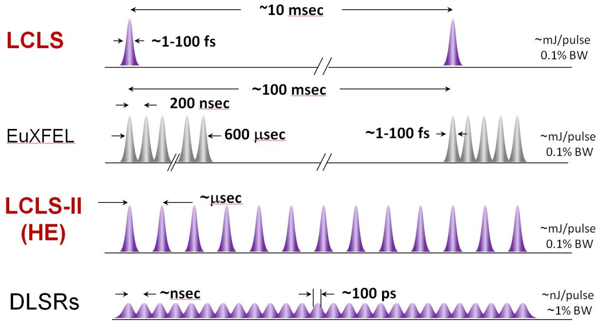

# XFEL beams

Original XFEl operates at 17.5 GeV per e-, and 27khz (but with a duty cycle), with 100fs precision per pulse.

Beam is 'nearly' coherent, so you can perform single-shot coherent imaging.

Duty cycle is 600us with 2700 pulses in it, so 200ns between pulses (5MHz rate)

Then then the remaining 99.4ms of the 100ms window is a readout time.

The Continuous Wave (CW) upgrade of the Eu XFEL will give it 100-200kHz operation, with 100 fs resolution pulses still.

Beam lines at LCLS range from 3-15 GeV, and has both a 120 Hz (copper accelerator) and 1 MHz (super-conducting accelerator) repetition rates

# Fundamentals

These energies are for all particle in a bunch, added up.

High-repetition rate single-shot imaging detectors.

The interaction of X-ray photons with matter is much weaker than electrons, so if you want to do Coherent Diffraction Imaging, you need *a lot* of particle. This is what an XFEL is for.

The MeV-UED experiement at SLAC is an Electron Camera.  Diffraction and microscopy are two techniques, depenting on structure size. The ultrafast aspects are 'UED' and 'UEM'. It has high spatial resolution (< 0.5 Å), large momentum-transfer range (0.5 to 12 Å-1), high elastic scattering cross sections, high temporal resolution (< 150 fs FWHM), with the additional benefits of relatively large penetration depths (> 100 nm) and negligible sample damage

Diffraction imaging (ultrafast/time-resolved), single shot

You need keV electrons to go below 1 angstrom, and Mev, to go below 1/100 of angstrom

"As the EDET DH80k camera does real-space imaging in integrating mode, no data reduction is possible."

Without any camera lenses, molecular movies rely on coherent waves where X-ray are deflected by electron shells, but more enegetic electrons make it all the way to the nucleus before scattering.

Thinner sensors (<150um) will reduce the multiple scattering of keV electrons, so this is targetted by commerical sensors often, but for the TEAM1k project (which was also used in SLAC's MeV-UED) MeV electrons are used. Thesehave less multiple scattering, and as they deposit ~5x less energy per unit length, a thicker sensor (~500um) is more desirable (see Bethe-Bloch, 1953).

In addition to time-resolved ultrafast microscopy/diffraction imaging to understand structure, you can also to ultra fast spectroscopy to understand energy.
It looks like the main mode of spectroscopy is attenuation/energy loss based, and uses photoelectrons. From a thesis: "The spectroscopic probe comprises time-resolved photo-electron spectroscopy and momentum-resolved photoion spectroscopy, while our structural probe makes use of ultrafast electron diffraction"

Pump probe techniques are important here, because you can choose at what moment to exite the system, and then shortly probe it after.

# detector

What application / illumination sources?

A 0.1 nm wavelength photon is E = (4e-15)*300e6/(0.1e-9) = 12 keV
A 0.1 nm wl electrons is E = 100 eV

'Electron imaging' is better for table-top applications. Photons can reach super shot time scales, but struggle with spatial resolution, and have often have to impart all of their particles in one focused bunch, to get the same spatial resolution as e-, as otherwise the sample will be destroyed before the enough aggregate stats are built up.

Photon light science can only be done where there is a high-energy syncrotron and light source.

